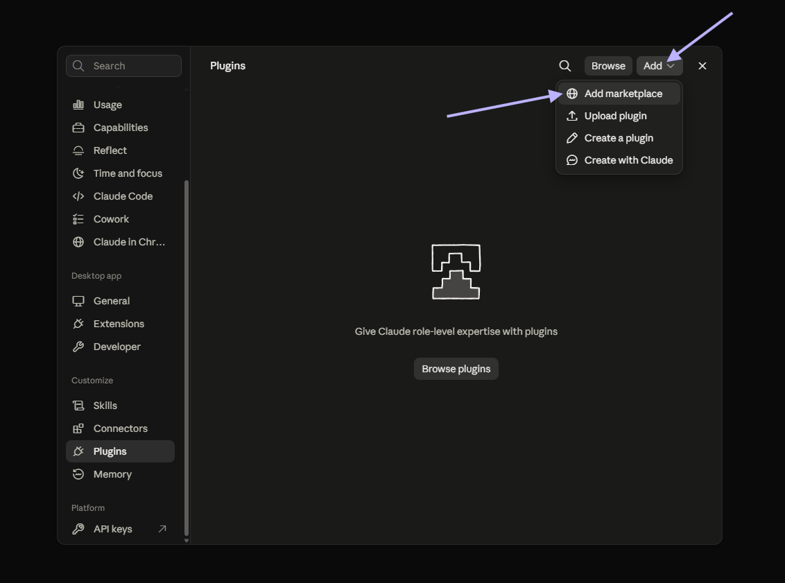
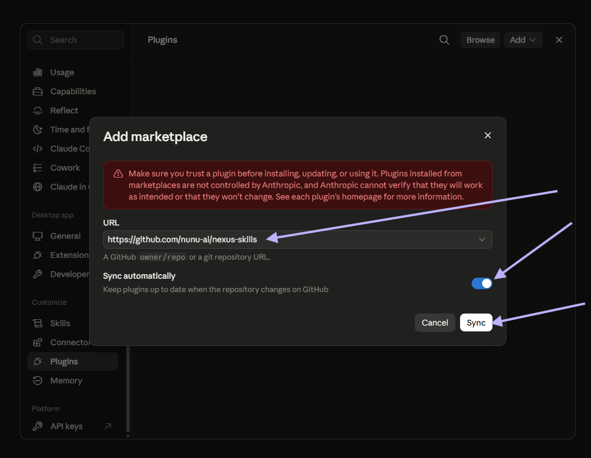
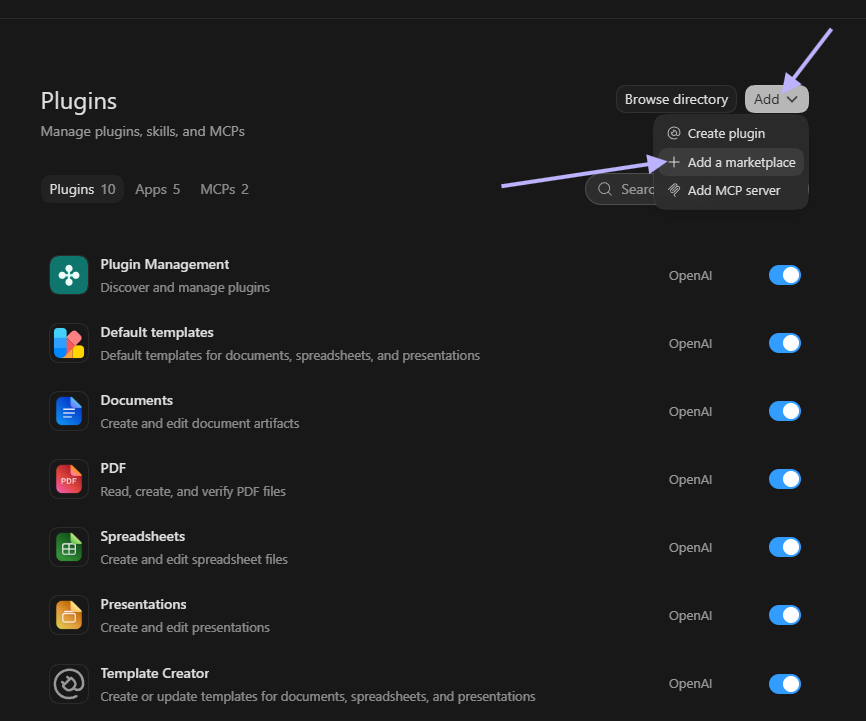
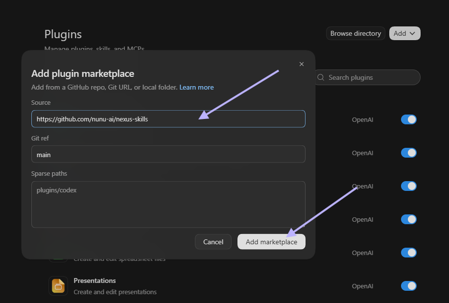

# nexus-skills

skills for the [nunu.ai](https://nunu.ai) nexus mcp/platform.

## Skills

- ✍️ **verification-test-authoring** — author, port, and edit high-quality verification tests for the nexus platform
- 🛠️ **flaky-test-refinement** — diagnose and stabilize flaky verification tests by comparing matched run history

## Install

<details>
<summary><strong>Claude</strong> — Desktop, Web, and Claude Code</summary>

### Install in Claude Desktop or web

1. Open **Settings → Plugins**.
2. Open the **Add** menu and select **Add marketplace**.



3. Enter `https://github.com/nunu-ai/nexus-skills`, keep automatic syncing
   enabled, and select **Sync**.



4. Browse the marketplace and install **Nexus Skills**.

### Claude Code CLI

Install:

```shell
/plugin marketplace add nunu-ai/nexus-skills
/plugin install nexus-skills@nunu-ai
```

Update:

```shell
/plugin marketplace update nunu-ai
/plugin update nexus-skills@nunu-ai
```

</details>

<details>
<summary><strong>Codex</strong> — Desktop and CLI</summary>

### Install in Codex Desktop

1. Open **Plugins**.
2. Open the **Add** menu and select **Add a marketplace**.



3. Enter `https://github.com/nunu-ai/nexus-skills` as the source and select
   **Add marketplace**.



4. Browse the plugin directory and install **Nexus Skills**.

### Update in Codex Desktop

Open **Plugins**, select the `nunu.ai Plugins` marketplace, and update
**Nexus Skills** when an update is available.

### Codex CLI

Install the marketplace:

```shell
codex plugin marketplace add nunu-ai/nexus-skills
```

Refresh it later:

```shell
codex plugin marketplace upgrade nunu-ai
```

After adding or refreshing the marketplace, install or update **Nexus Skills**
from the plugin directory. Restart Codex if the updated skills do not appear.

</details>
